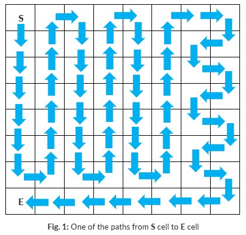

## Problem Statement
The task is to guide an explorer through an 8x8 grid (representing a mysterious forest) using a sequence of directions:
- D for Down
- U for Up
- L for Left
- R for Right
- Occasionally, an asterisk * appears in the sequence, allowing the explorer to choose any direction at that step.
The goal is to visit each cell of the grid exactly once in exactly 63 moves.  For example, the path of Fig. 1 consists of the following 63 directions:
#### DDDDDDRUUUUUURDDDDDDRUUUUUURDDDDDDRUUUUUURRDLDRDLDRDLDRDLLLLLLL

---

## Constraints

#### 1. Start and End Points:
- The explorer starts at cell (0, 0) (row 0, column 0).
- The explorer must end at cell (7, 0) (row 7, column 0).

#### 2. Grid Rules:
- Each cell must be visited exactly once.
- The explorer cannot revisit any cell or step outside the grid.

#### 3. Input Validation:
- The input sequence must contain the correct number of characters.
- Each character must be one of: 'U', 'D', 'L', 'R', or '*'.

#### 4. Performance:
- The program must display the execution time in milliseconds using Java System.currentTimeMillis().

#### 5. Code Restrictions:
- No use of Java Collections Framework or external libraries.
- Only use/extend examples/solutions provided in the course materials.
- No code copied from the Internet.

--- 

## Requirements
#### 1. Pathfinding Logic:
- Implement a method to explore all possible paths using DFS (Depth-First Search) and backtracking.
#### 2. Output:
- Display the total number of valid paths.
- Display the execution time in milliseconds.

#### 3. Efficiency:
- Optimize the program to run in less than 2 minutes.

---

## Sample Executions
```
Input: ***************************************************************

Total paths: 8,934,966

Time (ms): 35,270


Input: *****DR******R******R********************R*D************L******

Total paths: 5,739

Time (ms): 18,000
```